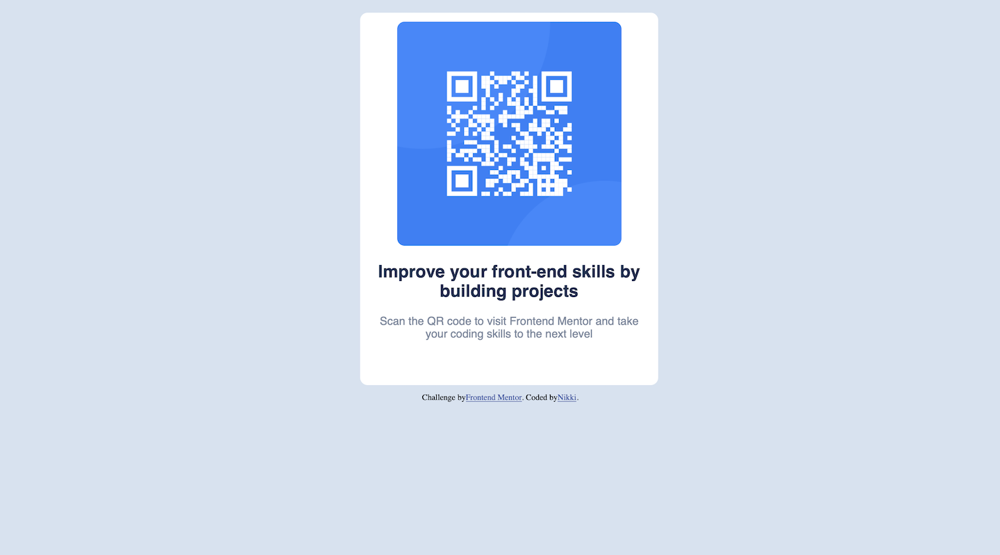

# Frontend Mentor - QR code component solution

This is a solution to the [QR code component challenge on Frontend Mentor](https://www.frontendmentor.io/challenges/qr-code-component-iux_sIO_H). Frontend Mentor challenges help you improve your coding skills by building realistic projects. 

## Table of contents

- [Overview](#overview)
  - [Screenshot](#screenshot)
  - [Links](#links)
- [My process](#my-process)
  - [Built with](#built-with)
  - [What I learned](#what-i-learned)
  - [Continued development](#continued-development)
- [Author](#author)

## Overview

First HTML CSS challenge.

### Screenshot

### Link

- Solution URL: [https://github.com/ngo500/html_css_practice/tree/main/QR_Code](https://github.com/ngo500/html_css_practice/tree/main/QR_Code)

### My process

### Built with

- Semantic HTML5 markup
- CSS custom properties
- Flexbox

### What I learned

I learned how to get started recreating an example HTML page. 

### Continued development

I want to continue using HTML and CSS to make my web pages look more polished and professional.

## Author

- Github - [Nikki](https://github.com/ngo500/html_css_practice/tree/main)

