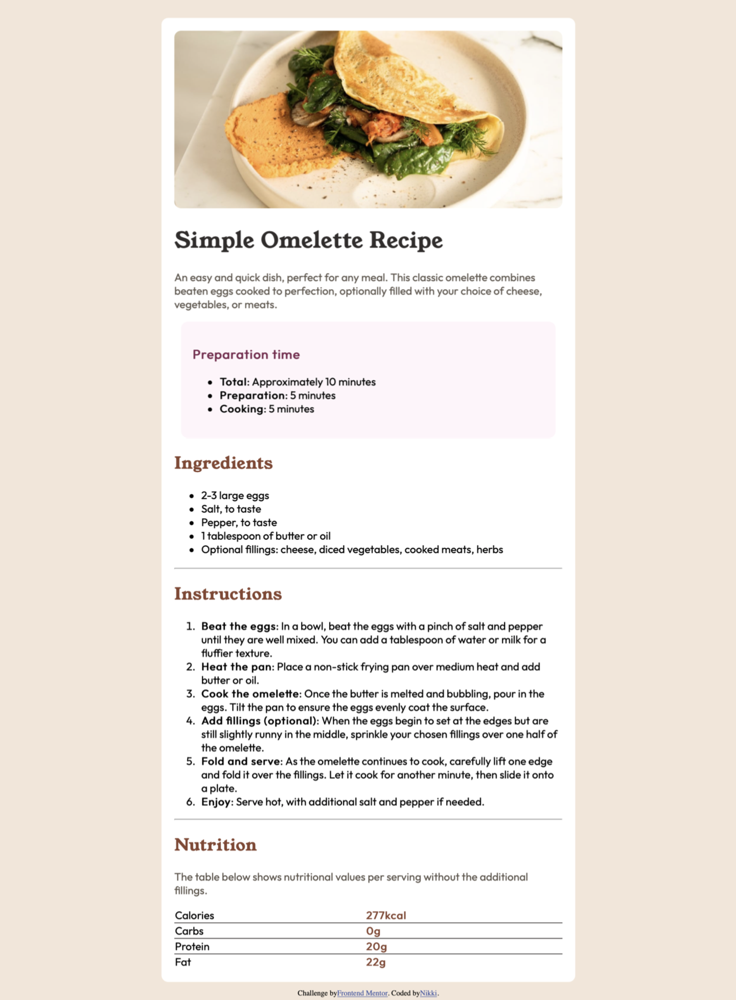

# Frontend Mentor - Recipe page solution

This is a solution to the [Recipe page challenge on Frontend Mentor](https://www.frontendmentor.io/challenges/recipe-page-KiTsR8QQKm). Frontend Mentor challenges help you improve your coding skills by building realistic projects. 

## Table of contents

- [Overview](#overview)
  - [Screenshot](#screenshot)
  - [Links](#links)
- [My process](#my-process)
  - [Built with](#built-with)
  - [What I learned](#what-i-learned)
  - [Continued development](#continued-development)
  - [Useful resources](#useful-resources)
- [Author](#author)

## Overview

### Screenshot

### Links

- Solution URL: [https://github.com/ngo500/html_css_practice/tree/main/Recipe_Page](https://github.com/ngo500/html_css_practice/tree/main/Recipe_Page)

## My process

### Built with

- Semantic HTML5 markup
- CSS custom properties
- Flexbox

### What I learned

I learned more about formatting and creating a webpage. I learned about fonts, custom fonts, and using local fonts.

### Continued development

I'd like to continue to grow my abilities, and get my page proportions more similar to the examples.

### Useful resources

- [Mozilla Dev @Font-Face](https://developer.mozilla.org/en-US/docs/Web/CSS/@font-face) - This page helped me understand how to include local fonts better.

- [Mozilla Dev Font-Family](https://developer.mozilla.org/en-US/docs/Web/CSS/font-family) - This helped me understand more about font, and font-family, in general.

## Author

- Github - [Nikki](https://github.com/ngo500/html_css_practice/tree/main/Recipe_Page)
